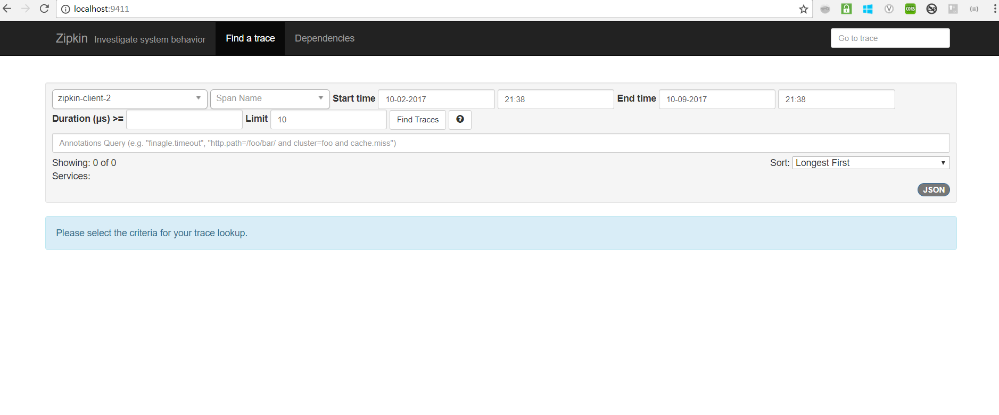
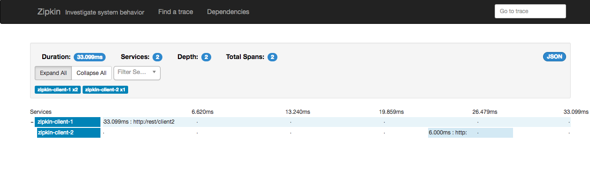

# spring-cloud-zipkin-tracing
This project contains samples demonstrating the microservices tracing using zipkin.

## spring cloud sleuth 

spring cloud sleuth automatically instruments common communication channels:

* Requests over messaging technologies like Apache Kafka or RabbitMQ (or any other spring cloud stream binder)
* HTTP headers received at Spring MVC controllers
* Requests that pass through a Netflix Zuul microproxy
* Requests made with the RestTemplate, etc.


### zipkin

<i>Distributed Tracing system to trace the request across services in microservices architecture.</i>

###  zipkin ui

Navigate to http://localhost:9411 to view Zipkin UI.



<table>


 <tr>
    <th style="text-align:left">Name</th>
    <th style="text-align:left">Port</th> 
    <th style="text-align:left">Description</th>
  </tr>
  <tr>
    <td><a href="https://github.com/BarathArivazhagan/spring-cloud-zipkin-tracing/tree/master/zipkin-ui-server"> zipkin-ui-server</a></td>
    <td>9411</td>
    <td>Zipkin UI server</td>
  </tr>
  <tr>
    <td><a href="https://github.com/BarathArivazhagan/spring-cloud-zipkin-tracing/tree/master/zipkin-client-1">zipkin-client-1</a></td>
    <td>8081</td>
    <td>Client application</td>
  </tr>
  <tr>
    <td><a href="https://github.com/BarathArivazhagan/spring-cloud-zipkin-tracing/tree/master/zipkin-client-2">zipkin-client-2</a></td>
    <td>8082</td>
    <td>Client application</td>
  </tr>
 
  
</table>


## How to build and run ?

- Download/Clone the repository : 
   
 ```
 $ git clone https://github.com/BarathArivazhagan/spring-cloud-zipkin-tracing && cd spring-cloud-zipkin-tracing
 $ ./mvnw clean install
 ```

- To run the application :

```
$ docker-compose up
```

## How to test the application ? 


<div>
	<span>Navigate to http://localhost:8081/client  Client 1 --> Client 2 interaction</span><br>
    <span>Navigate to http://localhost:8082/client   Client 2 --> Client 1 interaction </span>
</div>

## Zipkin Output: 

#### client1 app logs
```
2017-10-29 20:26:37.497  INFO [zipkin-client-1,9866ef627387f89d,9866ef627387f89d,true] 5025 --- [nio-8081-exec-8] com.barath.app.AppController             : Invoke Client 1 
```

#### client2 app logs

```
2017-10-29 20:26:37.521  INFO [zipkin-client-2,9866ef627387f89d,353315ba5919a55d,true] 5029 --- [io-8082-exec-10] com.barath.app.AppController             : Welcome Home from Client 2 is called 
```

#### In zipkin ui : 



## How to rebuild the project after the changes? 

```
$ docker-compose build
```


